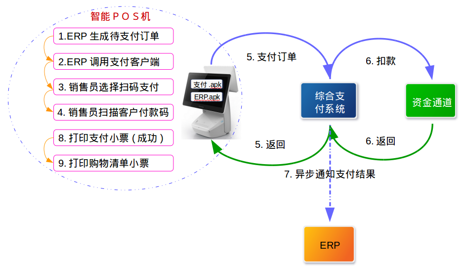
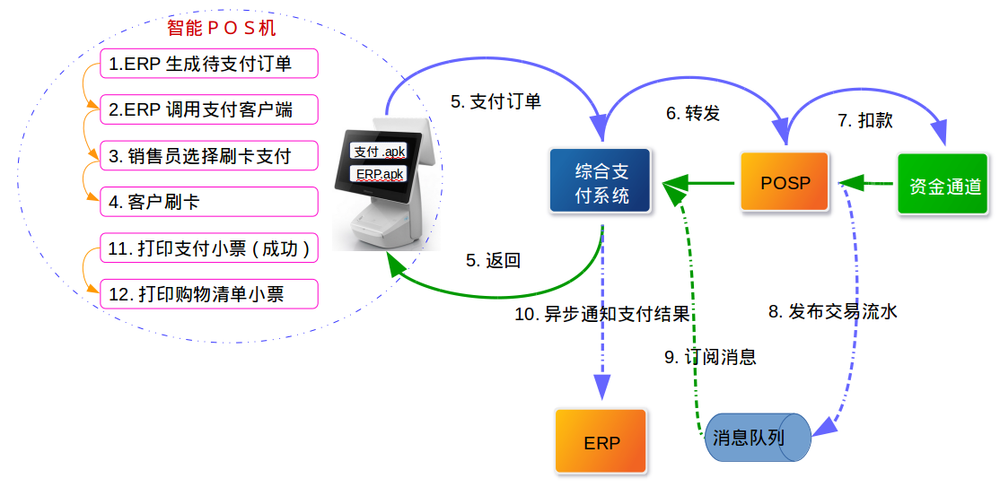
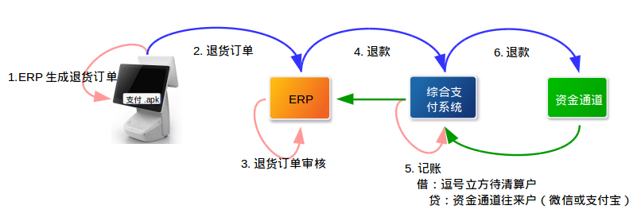
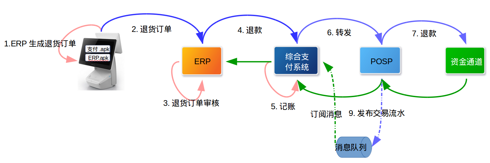

[TOC]
# 逗号立方支付解决方案
## 背景
逗号立方是邢台市区的一个综合性购物、娱乐、餐饮和服务的商场，按结构设计有330家商户入驻；目前该商场正在装修，计划12月24日试营业。8月22日已经与逗号立方进行支付解决方案整体需求讨论。
## 目的
根据8月22日需求讨论内容，整理交易处理流程，清结算处理流程，确定综合支付系统与逗号立方系统，统一支付系统和POSP系统业务边界。
最终形成我行为逗号立方提供的支付解决方案。

## 交易场景

### 开户

**流程说明**
> 逗号立方ERP系统将商户数据提交给综合支付系统，综合支付系统审核数据完成后本系统完成商户入驻并将商户入驻结果返回给ERP系统，然后将入驻商户信息发布到消息队列，POSP系统订阅该消息完成POSP系统商户入驻。
> POSP系统需对该类商户做特殊标记，不对该类商户做清结算。

### 扫码支付

**流程说明**
> Android系统的智能POS预先安装逗号立方的ERP管理软件和我行的支付软件。发起支付时ERP管理软件采集商户信息和商品信息，并组装支付订单发送给支付管理软件，支付管理软件调用扫描设备扫描客户的支付二维码（微信二维码或支付宝二维码），并将支付订单发送给综合支付系统。支付成功时支付软件打印支付小票，ERP管理软件打印购物清单小票。
> 综合支付系统收到智能POS请求的支付订单后，判断客户二维码类型选择匹配的资金通道完成扣款；扣款成功后采用异步形式通知逗号立方ERP系统支付结果。

### 刷卡支付

### 扫码退货

**流程说明**
> 逗号立方不支持部分退货

### 刷卡退货

## 清结算

## 系统业务边界
### 综合支付
+ 聚合支付工具，聚合线下二维码支付，聚合线上支付
+ 综合支付场景
+ 公共资金通道
+ 通用清结算模型
 
### POSP
+ 线下刷卡消费
 
> 综合支付系统开放商户，POSP系统同步全量商户，保证综合支付系统所有商户可以刷卡消费;
 消费完成后将交易流水同步给综合支付系统，综合支付系统做商户清结算。
