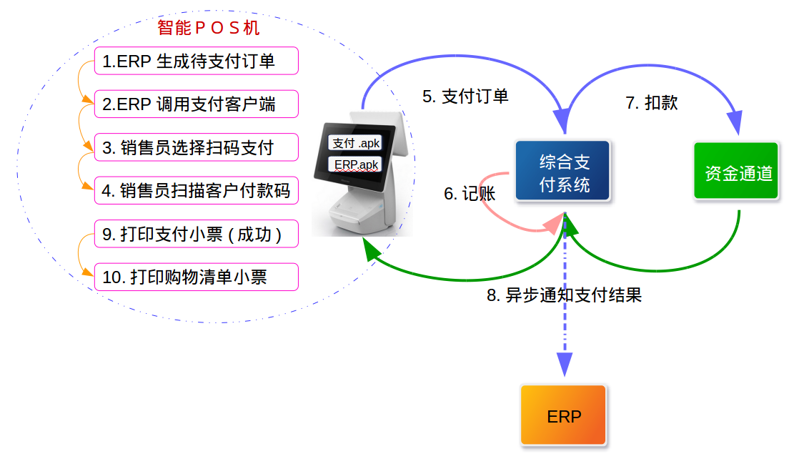
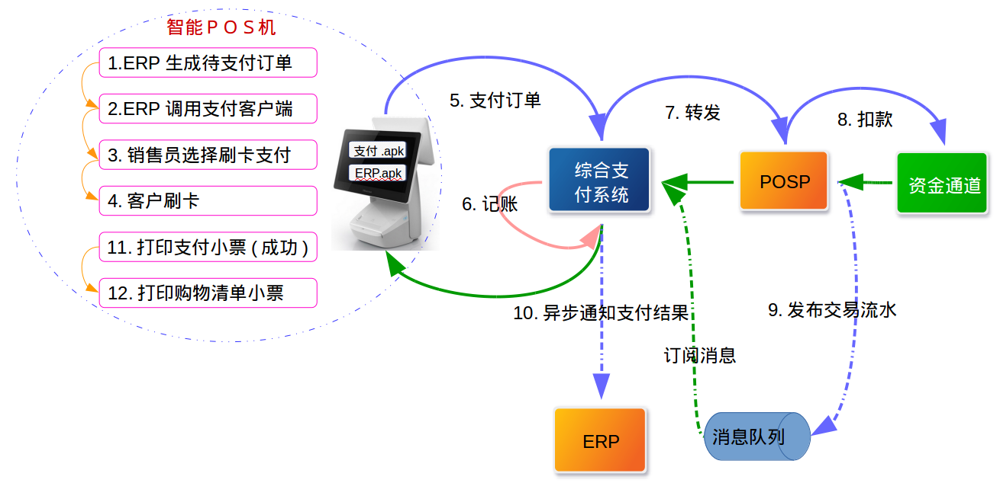
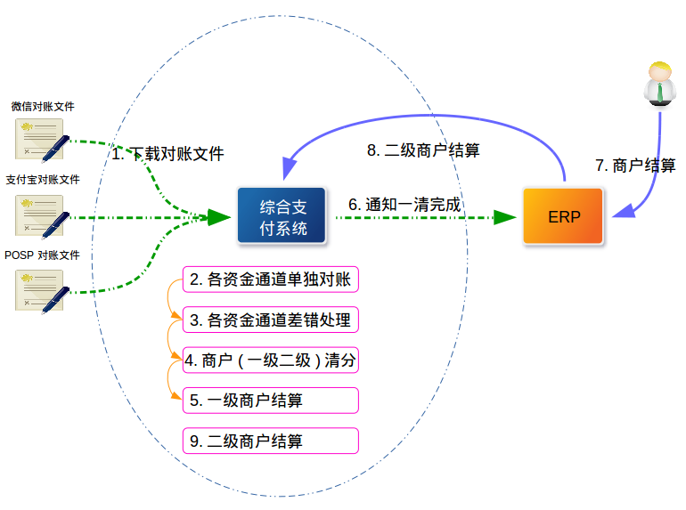

[TOC]
# 逗号立方支付解决方案
## 背景
逗号立方是邢台市区的一个综合性购物、娱乐、餐饮和服务的商场，按结构设计有330家商户入驻；目前该商场正在装修，计划12月24日试营业。8月22日已经与逗号立方进行支付解决方案整体需求讨论。
## 目的
根据8月22日需求讨论内容，整理交易处理流程，清结算处理流程，确定综合支付系统与逗号立方系统，统一支付系统和POSP系统业务边界。　最终形成我行为逗号立方提供的支付解决方案。

## 交易场景

### 开户

**流程说明**
> 逗号立方ERP系统将商户数据提交给综合支付系统，综合支付系统审核数据完成后本系统完成商户入驻并将商户入驻结果返回给ERP系统，然后将入驻商户信息发布到消息队列，POSP系统订阅该消息完成POSP系统商户入驻。  
> POSP系统需对该类商户做特殊标记，不对该类商户做清结算。

**后续工作**
1. 与POSP确认此开户流程是否可行
2. 确认在POSP系统开户需要商户数据
3. 明确综合支付系统商户开户所需数据
4. 与逗号立方确认开户数据及交互方式

### 扫码支付

**流程说明**
> Android系统的智能POS预先安装逗号立方的ERP管理软件和我行的支付软件。发起支付时ERP管理软件采集商户信息和商品信息，并组装支付订单发送给支付管理软件，支付管理软件调用扫描设备扫描客户的支付二维码（微信二维码或支付宝二维码），并将支付订单发送给综合支付系统。支付成功时支付软件打印支付小票，ERP管理软件打印购物清单小票。  
> 综合支付系统收到智能POS请求的支付订单后，判断客户二维码类型选择匹配的资金通道完成扣款；扣款成功后采用异步形式通知逗号立方ERP系统支付结果。

**会计分录**
> 微信支付
>> 借：微信待清算账户  
>> 　贷：平台资金账户

> 支付宝支付
>> 借：支付宝待清算账户  
>> 　贷：平台资金账户

**后续工作**
1. 与逗号立方沟通该支付流程是否满足需求
2. 确认综合支付系统通知ERP系统数据接口及规则

### 刷卡支付

**流程说明**
> POSP系统完成消费交易后将交易流水发布到消息队列，综合支付系统订阅消息，补录交易流水用于商户情分结算。

**会计分录**
> 借：银联待清算账户  
> 　贷：平台资金账户

**后续工作**
1. 与POSP确认该支付流程是否可行
2. 与POSP确认支付收单接口属性及交互规则
3. 与逗号立方沟通该支付流程是否满足需求

### 扫码退货

**流程说明**
> 逗号立方不支持部分退货

**会计分录**
> 微信支付
>> 借：平台资金账户  
>> 　贷：微信待清算账户

> 支付宝支付
>> 借：平台资金账户  
>> 　贷：支付宝待清算账户

**后续工作**
1. 与逗号立方沟通该退货流程是否满足需求
2. 与逗号立方确认退货交易接口
3. 与逗号立方确认退款金额大于该商户待结算金额时是否使用逗号立方的资金账户退款（即是否使用逗号立方资金池账户继续退款）
4. 是否需要通过电子账户系统记录二级商户的待清算余额

### 刷卡退货

**会计分录**
> 借：平台资金账户  
> 　贷：银联待清算账户

**后续工作**
1. 与POSP确认该支付流程是否可行
2. 与POSP确认支付收单接口属性及交互规则
3. 与逗号立方沟通该支付流程是否满足需求

## 清结算

**会计分录**
> 一级结算
>> 借：平台资金账户    
>>　贷：一级商户结算账户
>
> 二级结算
>> 综合支付系统按照与一级商户的协议约定结算周期将待结算款项结算到一级商户结算账户      
>>
>> 借：一级商户结算账户       
>> 　贷：二级商户结算账户 

非逗号立方需求
> 多级商户直接清算给末级商户且向上级商户同步清算明细数据，
综合支付系统需要将每个末级商户注册为其平台商户，约定结算周期，结算账户等信息并且记录与上级商户的逐级关系。综合支付系统按照与末级商户约定的结算周期将待结算款结算到末级商户结算账户并且将商户结算明细数据逐级推送给该商户对应的上级商户。  
  
**后续工作**
1.ERP系统向综合支付系统发送清算指令格式需要明确

## 系统业务边界
### 综合支付
+ 聚合支付工具，聚合线下二维码支付，聚合线上支付
+ 综合支付场景
+ 公共资金通道
+ 通用清结算模型
 
### POSP
+ 线下刷卡消费
 
> 综合支付系统开放商户，POSP系统同步全量商户，保证综合支付系统所有商户可以刷卡消费;消费完成后将交易流水同步给综合支付系统，综合支付系统做商户清结算。
 
## 待解决问题
 + 与逗号立方ERP系统对接流程涉及的详细接口说明
 + 综合支付系统需要使用现有统一支付的微信二维码和支付宝二维码支付接口，目前的思路是将资金通道独立，统一支付和综合支付都作为渠道使用资金通道，资金通道统一做交易对账和交易二清。
 + 与POSP系统对接可行性分析
