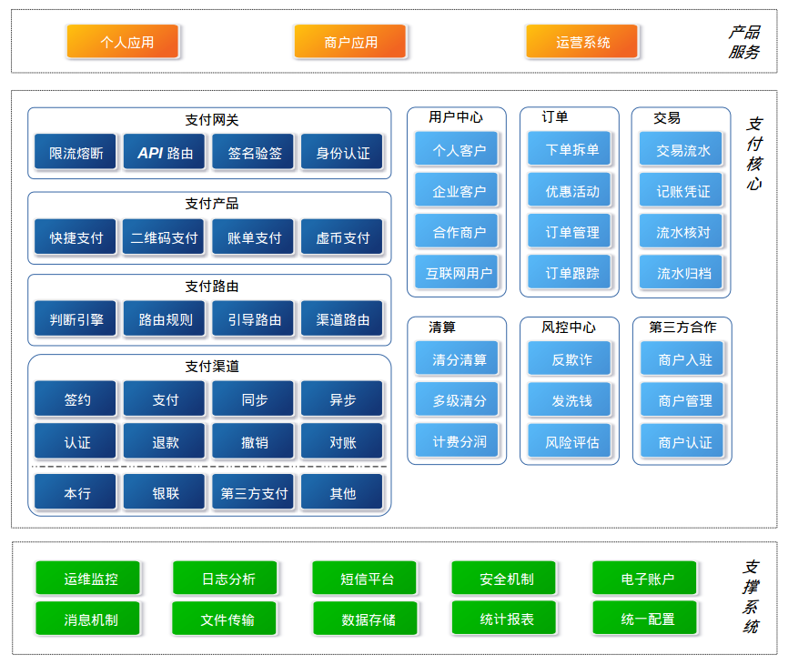

[TOC]
# 统一支付平台调研分析
## 编写背景
我行统一支付平台项目于2016年11月正式启动，2017年1月27日上线。目前已经对接四家B2C电商平台，分别是美食林电商平台，瑞科玻璃，快玻玻璃，移联网信电商平台；目前正在与家乐园对接。在统一支付平台建设、上线和推广的过程中产生了一系列的问题，已经对统一支付平台当前业务的拓展和推广进度产生影响，可能造成我行相关业务市场份额被同业或其他第三方吞噬。
## 编写目的
在统一支付平台已经上线部分业务正常运行，部分业务正在建设，部分业务已经上线但无法推广的背景下；对统一支付平台的业务现状，支付产品能力，技术架构特点进行梳理；并结合业务部门需求和业务规划；评估现有支付平台能否满足我行要求，井然有序的进行业务设计和推广。
## 统一支付平台梳理
### 建设背景
2016年我行达成与美食林集团和移联网信的合作计划，为两家企业提供线上收银台，并为两家企业的商户及其子商户提供资金清分结算业务；同时我行也有发展线上收单和线下收单的业务规划；在此前提下我行提出建设统一支付平台的方案。
### 建设目标
我行建设统一支付平台的目标主要包括；建设我行的线上收单和线下收单（二维码收单）产品；依托两个收单产品拓展我行的优质合作商户，为商户提供资金清结算服务增加我行的资产规模。依托支付平台的支付资金通道丰富我行的支付方式，优化我行支付工具的便捷性。
### 存在的问题
经过与我行统一支付平台信息科技部和电子银行部负责人充分讨论，发现目前统一支付平台主要包含产品客户化能力问题，开发厂商现场实施项目管理问题，项目实际交付功能少于SOW问题。

#### 产品客户化能力问题
厂商的支付平台有自己的设计思想、功能范围，我行要求的支付平台有自己的业务需要；在此前提下厂商需要携带自己的产品按我行的要求进行现场客户化。在项目实施过程中，经常会发生我们的业务需求厂商无法实现或实现起来非常困难；我们只能被迫改变需求或推迟业务推广，严重的情况造成我行业务无法推广。

问题案例
>不支持多级商户清算
>线下二维码收单产品存在严重缺陷，造成我二维码收单业务无法推广

#### 厂商项目管理问题
1. 开发厂商未按我行要求的项目管理规范指定详细的项目需求规格说明书，造成实施过中需求管理混乱，需求边界模糊不清，工作秩序差，工作反复度高，严重影响工作效率。
2. 项目实施过程中开发厂商未做好质量把控，缺少单元测试和集成测试；直接将开发完成的功能交付给我行做用户测试，造成行内人员工作量陡增。为保证我行业务按时推广只能选择性将部分非关键业务延迟发布。
3. 项目组为做好测试bug管理，造成修改效率地下；我们不监督催促厂商的工作进度就缓慢。

#### 实际交付功能少于SOW问题
项目SOW中包含电商平台，但实际的项目实施无法落地。

### 项目成果
#### 线上收单
目前我行统一支付平台对接五家线上收单商户，列表如下；

| 序号 | 商户名称 | 服务产品 | 状态 |
| --- | ------- | --------| ----|
| 1 | 美食林 | B2C线上收银台 | 已上线 |
| 2 | 瑞科玻璃 | B2C线上收银台 | 已上线 |
| 3 | 快玻玻璃 | B2C线上收银台 | 已上线 |
| 4 | 移联网信 | B2C线上收银台 | 已上线 |
| 5 | 家乐园 | B2C线上收银台 | 建设中 |

#### 线下二维码收单
自7月11日二维码收单上线，截止到8月4日二维码收单共发展48家商户，由于商户入驻流程设计问题造成该业务无法大面积推广。

### 支付通道对接
目前我行统一支付平台已经对接五家资金通道，列表如下；

| 序号 | 支付企业 | 支付类型 | 状态 | 备注 |
| --- | ------- | -------| ---- | --- |
| 1 | 邢台银行 | 借记卡 | 已上线 |  |
| 2 | 邢台银行 | 积分 | 已上线 |  |
| 3 | 邢台银行 | 公务卡 | 测试中 |　　|
| 4 | 银联 | 快捷支付 | 已上线 |  |
| 5 | 银联 | 在线支付 | 已上线 |  |
| 6 | 中金 | 在线支付 | 部分上线 | B2C已上线，B2B未上线 |
| 7 | 中金 | 快捷支付 | 部分上线 | B2C已上线，B2B未上线 |
| 8 | 中金 | 代扣 | 部分上线 | B2C已上线，B2B未上线 |
| 9 | 微信 | 二维码支付 | 已上线 |  |
| 10 | 支付宝 | 二维码支付 | 已上线 |  |

### 我们需要什么样的统一支付平台
经过与电子银行部讨论，我们需要以用户（**用户包括我行客户、我行商户、我行员工**）为中心的统一支付平台，围绕这三类用户的业务场景，依托支付核心功能（网关、订单、风控、路由、资金通道），打造适满足市场需求的支付负产品。

通过对上述核心需求的分析，支付核心功能是技术核心（从目前阶段分析），为三类用户打造符合市场需求的产品是业务核心（即：目标）。所以打造高效、稳定、易扩展、易维护的支付核心是后续业务有序拓展的基础条件；对三类用户深度分析并设计优质产品的能力是占领市场先机的条件，具备一支稳定、高效、执行力强的实施团队是推出产品的保障。

综上所述，我们需要的不仅仅是支付平台这个系统，还需要的是懂得以客户为中心的产品经理，还需要一支合适的实施团队。

>注：统一支付平台不仅仅是一个系统，他是在不断成长的，每一项业务都需要不断的完善和优化，同时不断的承载新的业务场景。

### 现有统一支付平台是否满足我们的要求
结合章节《我们需要什么样统一支付平台》内容，我个人认为从系统自身、产品设计和实施团三个方面都不满足我们的要求。
>注：为什么不满足我们的要求，请阅读章节《存在的问题》

## 后续规划建议
高效的统一支付平台　＝　优质系统　＋　优质产品经理　＋　优质实施团队

### 系统规划

>注：此图仅从逻辑上描述系统技术模块和业务模块，落实到系统上还需进一步设计。

支付系统架构从逻辑上分三层

+ 支撑层，用来支持核心系统的基础软件包和基础设施， 包括运维监控系统、日志分析系统等。
+ 核心层，支付系统的核心模块，内部又分为两个部分：支付核心模块以及支付服务模块。
+ 产品层，通过核心层提供的服务组合起来，对最终用户、商户、运营管理人员提供的系统。

支付平台作为行内资源输出和行外资源输入的通道，还需要与我行现有电子渠道系统手机银行、个人网银、企业网银紧协作，按客户类型建设特色的电子渠道。为实现支付平台与行外合作方高效对接，电子账户系统为支付平台提供核心的账户、会计、核算服务。

架构设计要求  
1. 稳固的支付核心灵活的业务场景
2. 易扩展的逻辑架构和数据架构
3. 高效便捷的数据通讯/交互方式
4. 高性能的数据落地存储方案
5. 高可用的服务化架构设计

### 产品经理能力
产品经理为产品的整个生命周期负责，作为产品的灵魂，具备产品规划的能力，具备同类支付系统行业背景，具备深入分析用户需求的能力，具备将用户需求转化为可落地的产品需求的能力。
### 实施团队要求
系统和研发团队都是我们的，我们即需要系统，我们同样需要能力。
