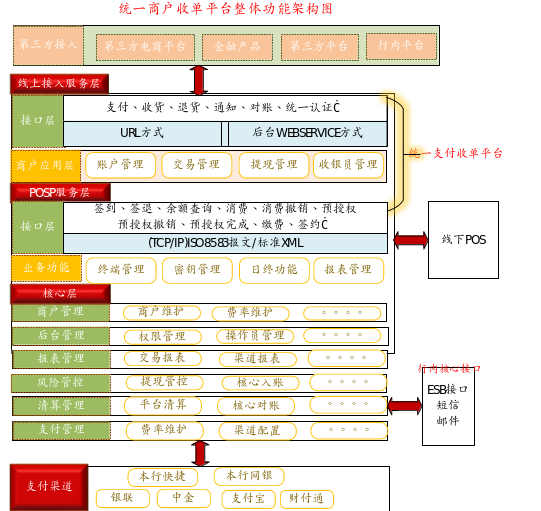
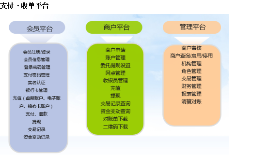
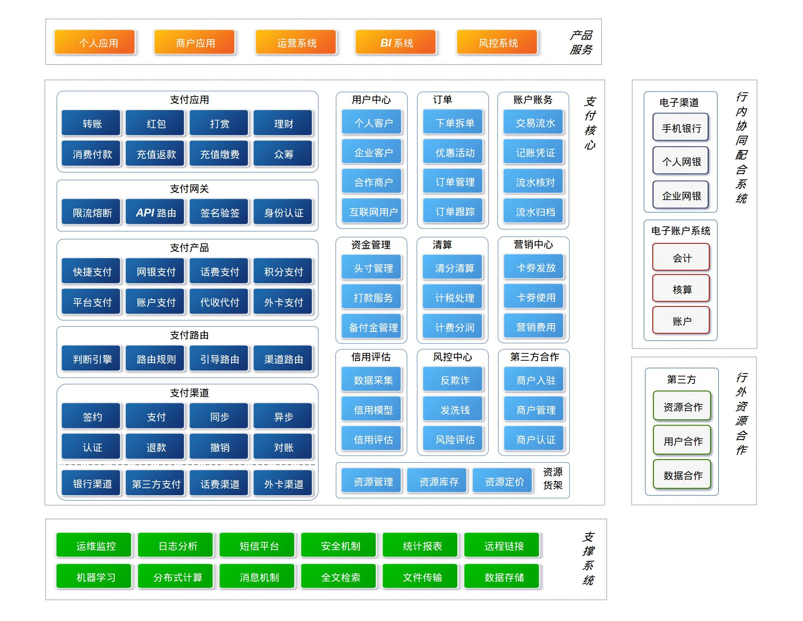

[TOC]
# 统一支付平台调研
## 编写背景
面对互联网金融对传统银行业的冲击，我行提出了大科技和大零售战略，打破了以往的部门各自为战的局面，以更高的视角审视分析市场环境，多部门联合行动指定实施方案；采用上下联动，公私联动，业务数据化、数据业务化的行动方针，以客户为中心为我行的个人客户和企业客户提供更便捷优质的服务，为我行的两个翻一番目标打下了良好基础。
## 编写目的
我行大科技和大零售战略目前初具雏形，从科技角度对两大战略落地分析，**统一支付平台是实现两大战略的基石**，所以评估目前的统一支付平台能否支撑我行的两大战略十分关键。通过本次评估确定如下内容。  

+ 是否可以满足全行各业务部门对两大战略提出的业务需求;  
+ 是否可以满足以客户为中心为客户提供便捷优质服务的需求;  
+ 是否可以应对互联网业态灵活多变的市场环境;    
+ 是否可以应对互联网业态敏捷高效的实施节奏;  
+ 是否可以应对互联网不确定流量访问的冲击；

## 统一支付平台现状梳理
### 产品定位
互联网金融核心是以支付基石，支付是流量入口和资金通道，是所有互联网金融电子商务业务形态的基础，直销银行、商城等都是金融电商的具体业务。
### 系统简介
+ 互联网统一支付平台的目的是实现我行线下及线上支付收单业务，通过不同支付渠道完成网络支付，资金归集，支付收单结算等业务。
+ 产品整体设计使用对象主要是在线客户、商户和银行运营管理人员。对应的支付渠道包括本行快捷支付、网银支付、手机网关支付、第三方支付（支付宝、银联、财付通、中金支付等）、担保支付、二维码支付、积分支付、商城账户支付等。
### 业务架构

### 已实现业务场景
> 担保支付  
> 代理清算  
> 资金监管（房屋交易）  
> B2C线上收单  
> B2B收单  
> 公共事业缴费  
> 线下二维码收单  

### 逻辑架构
整个支付平台的系统组成主要包括以下子系统:  
> 虚拟账户服务系统  
实名认证体系  
支付接入系统  
支付服务方对接系统  
清算分润系统  
支付结算系统  
商户服务系统  
安全子系统  
风险控制系统  
运营监控系统  
报表系统  
系统管理  
二维码发放子系统  

## 技术架构

:smile:待完善

## 统一支付平台思考
### 现有统一支付平台能否满足我行需要

现有统一支付平台如何满足如下业务、技术和团队需求：

+ 业务要求
1. 大零售和大科技战略的基石业务系统
2. 以客户为中心，为不同类型客户定制化服务场景
3. 异业合作，实现我行资源输入和杭外优质资源引入

+ 技术要求  
1. 稳固的支付核心灵活的业务场景
2. 易扩展的逻辑架构和数据架构
3. 高效便捷的数据通讯/交互方式
4. 高性能的数据落地存储方案
5. 高可用的服务化架构设计

+ 团队要求
1. 高效、敏捷、稳定和执行力强的实施团队应对灵活变动的业务需求
2. 经验资深且创新敏锐的产品经理进行产品设计
3. 优秀的项目经理进行计划安排，资源协调
4. 高水平的架构师不断对系统进行规划/重构

面对上述业务、技术、团队要求，通过对现有支付平台的梳理，是否可以满足要求值得我们深思。相信现有的支付平台可以实现我们当下提出的业务需求，但从业务架构、技术架构和实施团队角度分析，难以支撑我行大科技和大零售长远目标。在我行正在转型的关键时期，我们即需要当下更需要未来；所以对我行统一支付平台重新设计势在必行。

## 新统一支付平台规划（建议）
### 产品定位
在传统支付平台的基础上实现如下业务目标:  

1. 以客户为中心为客户打造综合性服务场景，主要包括：便民生活类，资金往来类，购物娱乐类，财富管理类，教育公益类等。  
2. 支持与第三方资源方快速对接合作，将第三方资源通过我行渠道输出给我行客户或互联网客户  
3. 打通支付平台用户与我行个人网银、手机银行、企业网银的用户，实现业务多渠道协同和资源多渠道共享  
4. 打通支付平台用户与互联网用户实现我行资源向互联网客户输出。  

### 逻辑架构

支付系统架构从逻辑上分三层

+ 支撑层，用来支持核心系统的基础软件包和基础设施， 包括运维监控系统、日志分析系统等。
+ 核心层，支付系统的核心模块，内部又分为两个部分：支付核心模块以及支付服务模块。
+ 产品层，通过核心层提供的服务组合起来，对最终用户、商户、运营管理人员提供的系统。

支付平台作为行内资源输出和杭外资源输入的核心通道，还需要与我行现有电子渠道系统手机银行、个人网银、企业网银紧协作，按客户类型建设特色的电子渠道。为实现支付平台与杭外合作方高效对接，电子账户系统为支付平台提供核心的账户、会计、核算服务。
### 技术架构

:smile:待完善
