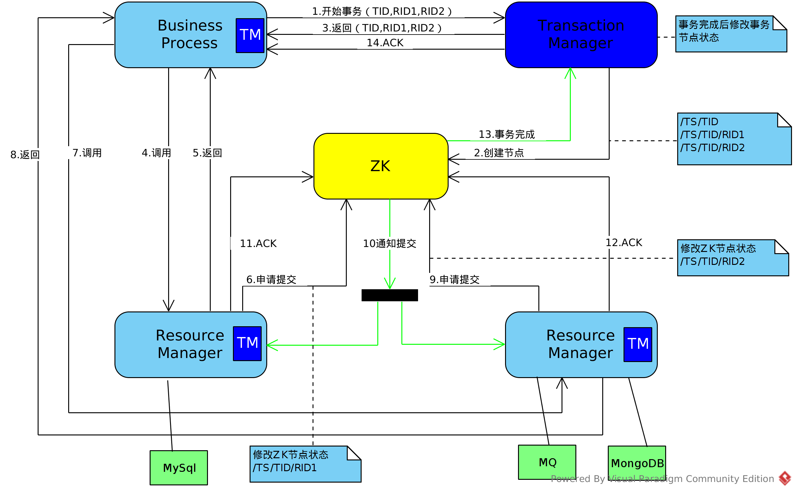

分布式系统中完整的业务被拆分到多个服务系统中，所以无法使用RDBMS的事务保证整个业务功能的原子性。所以目前交通用的出发方式为采用柔性事务，主要可以分为：多阶段提交型、补偿型、异步确保型、最大努力通知型。

# 基于zookeeper的多阶段提交事务设计
## 整体结构

整体结构分为：事务管理服务(Transaction Manager)、资源管理服务（Resource Manager)、业务处理模块（Business Process)三步分。
- Transaction Manager
协调系统控制全局事务，管理事务生命周期，并协调资源。
- Resource Manager
负责控制和管理实际资源系统
- Business Process
负责调用实际业务资源完成整个业务操作

### 流程说明
1. 业务系统请求事务管理系统开始事务,根据业务情况将需要在事务中控制的资源上送给事务管理服务。
> 传递参数：(事务：TID,资源ID：RID,资源ID：RID，RID...)

2.事务管理服务在zk上建立新建该事务涉及资源的关系并监控节点状态
> /TS/TID
>> /TS/TID/RID1
>> /TS/TID/RID2
>> /TS/TID/RID...

3. 事务管理服务返回事务开始状态
4. 业务系统调用提供资源的服务，传递参数：TID,RID1,RID2,RID...,其他业务参数
5. 资源服务按既定方式处理业务逻辑，但是部做DB COMMIT，处理完成后直接返回结果
6. 资源服务修改zk中该资源对应的事务状态
7. 与`4`一致
8. 与`5`一致
9. 与`6`一致
> 步骤5或8如果失败直接责修改zk中对应的事务状态，交易管理服务检测到资源失败状态则修改事务状态为失败，第10步则被触发，资源服务系统则回滚事务，事务回滚后事务管理起则自动检测到，然后通知业务系统交易失败。

10. 当业务系统涉及到的所有资源都申请提交完毕后，事务管理服务修改整个事务状态为申请提交完毕，资源管理服务检测到状态后做该资源的事务提交。
11. 资源服务做完事务提交后更新zk中资源对应事务状态
12. 与`11`一致
13. 事务管理服务检测到事务相关资源都已提交后返回给业务管理系统事务完成

